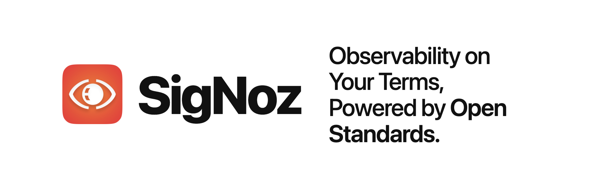

<p align="center">
  <a href="https://signoz.io" target="_blank">
    <picture>
      <source media="(prefers-color-scheme: dark)" srcset="docs/readme-assets/signoz-hero-dark.png" width="900">
      <source media="(prefers-color-scheme: light)" srcset="docs/readme-assets/signoz-hero-light.png" width="900">
      
    </picture>
  </a>
</p>

<h1 align="center" style="border-bottom: none">SigNoz OpenTelemetry Collector</h1>

<p align="center">
  <a href="https://github.com/SigNoz/signoz-otel-collector/releases"></a>
  <a href="https://golang.org"></a>
  <a href="LICENSE"></a>
  <a href="https://github.com/SigNoz/signoz-otel-collector/issues"></a>
  <a href="https://signoz.io/slack"></a>
</p>

<p align="center"><b>One agent for all your telemetry, and the front door to SigNoz.</b></p>

<p align="center">SigNoz's distribution of the OpenTelemetry Collector receives, processes, and exports your logs, metrics, and traces.</p>

<h3 align="center">
  <a href="https://signoz.io/docs/"><b>Documentation</b></a> &bull;
  <a href="https://signoz.io/teams/"><b>SigNoz Cloud</b></a> &bull;
  <a href="https://signoz.io/slack"><b>Slack</b></a> &bull;
  <a href="https://signoz.io"><b>Website</b></a>
</h3>

## Overview

This repository builds the OpenTelemetry Collector distribution that powers SigNoz.

It combines a curated set of upstream OpenTelemetry Collector and Collector-Contrib components with SigNoz's own components: receivers, processors, exporters, connectors, and an extension.

Like any Collector, where your telemetry goes is decided by the exporters in your pipeline. The SigNoz exporters write to ClickHouse, the store behind SigNoz. You can run the collector from a static config file, or manage it remotely over OpAMP (Open Agent Management Protocol).

## About SigNoz

[SigNoz](https://signoz.io) is an open-source observability platform built on OpenTelemetry, with logs, metrics, traces, alerts, and dashboards in one place. This collector is the ingestion layer that feeds it.

- Get started with [SigNoz Cloud](https://signoz.io/teams/) for free, or [self-host SigNoz](https://signoz.io/docs/install/self-host/).
- Star and explore the main project at [SigNoz/signoz](https://github.com/SigNoz/signoz).

## Why SigNoz OpenTelemetry Collector?

Here are a few reasons teams run this collector:

- **Built on [OpenTelemetry](https://opentelemetry.io/)**: works with standard OTLP sources and the upstream Collector components you already know.
- **Everything SigNoz needs in one build**: upstream Collector and Contrib components alongside SigNoz's own receivers, processors, exporters, connectors, and an extension.
- **Fast storage**: the SigNoz exporters write to ClickHouse, an extremely fast and highly optimized store for observability data.
- **Runs your way**: from a static config file, or managed remotely over OpAMP.

## Getting Started

The easiest way to run SigNoz, including this collector, is with [Foundry](https://github.com/signoz/foundry), the SigNoz deployment tool, which installs and configures the collector for you. You can also build and run the collector from source for local development or custom images.

Prerequisites: [Go 1.25+](https://golang.org/dl/).

Build the collector:

```bash
make build
```

Run it against a config file:

```bash
make run
# make run uses ./config/default-config.yaml. To pass your own:
go run ./cmd/signozotelcollector --config ./config/default-config.yaml
```

On success the collector starts and accepts telemetry on the OTLP (OpenTelemetry Protocol) endpoints declared by its receivers, HTTP on `4318` and gRPC on `4317` by default. See [`example/example-config.yaml`](example/example-config.yaml) for a complete pipeline.

Build the container image:

```bash
make build-signoz-collector
```

## Configuration

The collector reads a standard OpenTelemetry Collector configuration: `receivers`, `processors`, `exporters`, `connectors`, `extensions`, and a `service` block of pipelines. See [`config/default-config.yaml`](config/default-config.yaml) and [`example/example-config.yaml`](example/example-config.yaml).

You can supply configuration in one of two ways:

- **Static file**: pass `--config <path-to-config>`. The collector reads the file at startup.
- **Managed (OpAMP)**: pass `--manager-config <path-to-manager-config>` (see [`config/default-manager-config.yaml`](config/default-manager-config.yaml)). The collector fetches its configuration from a remote OpAMP server, and copies the active config to `--copy-path` (default `/etc/otel/signozcol-config.yaml`).

## CLI reference

```
signoz-otel-collector [flags]

Flags:
  --config string           Path to the collector configuration file
  --manager-config string   Path to the OpAMP agent manager configuration (enables managed mode)
  --copy-path string        Where the active config is written in managed mode
                            (default "/etc/otel/signozcol-config.yaml")
  --feature-gates string    Comma-delimited feature gate identifiers; prefix with '-' to disable,
                            '+' or no prefix to enable

Commands:
  migrate                   Run schema migrations for the telemetry store
```

Run `signoz-otel-collector <command> --help` for a command's subcommands and flags.

## Components

This distribution bundles upstream OpenTelemetry Collector and Collector-Contrib components together with SigNoz-specific receivers, processors, exporters, connectors, and an extension. See [`components/components.go`](components/components.go) for the full list of registered components.

## Development

```bash
make build           # build the collector
make test            # go test with the race detector and coverage
make fmt             # gofmt
make lint            # golangci-lint
make test-and-lint   # test + fmt + lint (default target)
```

## Contributing

We ❤️ contributions big or small. Open an [issue](https://github.com/SigNoz/signoz-otel-collector/issues) or a pull request to get started. Not sure where to begin? Just ping us on `#contributing` in our [Slack community](https://signoz.io/slack).

## Community

Come say Hi to us on [Slack](https://signoz.io/slack) 👋 to talk observability, OpenTelemetry, and SigNoz, and to connect with other users and contributors. If you have ideas, questions, or feedback, share them on [GitHub Discussions](https://github.com/SigNoz/signoz/discussions).

## License

Licensed under the [GNU Affero General Public License v3.0](LICENSE).
